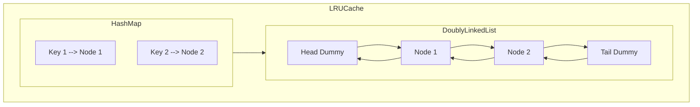

# LRU Cache Implementation

## Overview
This project implements a Least Recently Used (LRU) Cache with O(1) time complexity for both `get` and `put` operations. The cache has a fixed capacity and automatically evicts the least recently used item when exceeding capacity. This implementation is optimized for high-performance scenarios with up to 10⁵ operations.

## Key Features
- O(1) average time complexity for all operations
- Efficient eviction policy for cache management
- Clean C++ implementation using doubly linked lists and hash maps
- Comprehensive test cases included
- Detailed documentation and architecture diagram

## Architecture
The LRU Cache combines a doubly linked list for access ordering with a hash map for O(1) lookups:


### Components
1. **Doubly Linked List**:
   - Maintains cache items in access order (most recent at head)
   - Dummy head/tail nodes simplify edge cases
   - O(1) node insertion and removal

2. **Hash Map**:
   - Maps keys to their corresponding list nodes
   - Enables O(1) key lookups

3. **Operations**:
   - `get()`: Returns value and moves item to head
   - `put()`: Inserts/updates value and manages evictions

## Time Complexity
| Operation | Complexity | Description |
|-----------|------------|-------------|
| `get()`   | O(1)       | Hash map lookup + constant time list update |
| `put()`   | O(1)       | Hash map update + constant time list operations |

## How to Use

### Compilation
```bash
g++ lru_cache.cpp -o lru_cache
```

### Execution
```bash
./lru_cache
```

### Example Usage
```cpp
int main() {
    LRUCache lru(2);
    lru.put(1, 1);
    lru.put(2, 2);
    cout << lru.get(1) << endl;  // Returns 1
    lru.put(3, 3);               // Evicts key 2
    cout << lru.get(2) << endl;  // Returns -1 (not found)
    lru.put(4, 4);               // Evicts key 1
    cout << lru.get(1) << endl;  // Returns -1
    cout << lru.get(3) << endl;  // Returns 3
    cout << lru.get(4) << endl;  // Returns 4
    return 0;
}
```

### Expected Output
```
1
-1
-1
3
4
```

## Implementation Details

### Node Structure
```cpp
class Node {
public:
    int key;
    int val;
    Node* prev;
    Node* next;
    Node(int k, int v) : key(k), val(v), prev(nullptr), next(nullptr) {}
};
```

### LRUCache Class
```cpp
class LRUCache {
private:
    int capacity;
    unordered_map<int, Node*> cache;
    Node* head;
    Node* tail;

    // Helper methods for list operations
    void addNode(Node* node);
    void removeNode(Node* node);
    void moveToHead(Node* node);
    Node* popTail();
    
public:
    LRUCache(int cap);
    int get(int key);
    void put(int key, int value);
};
```

### Critical Operations
1. **Adding a Node**: Inserted after head (most recent position)
2. **Removing a Node**: Extracted from current position
3. **Moving to Head**: Combines removal and addition
4. **Popping Tail**: Removes least recently used node

## Performance
- Handles maximum capacity of 3000 items
- Efficiently processes up to 100,000 operations
- Minimal memory overhead (2 pointers per node + hash map)
